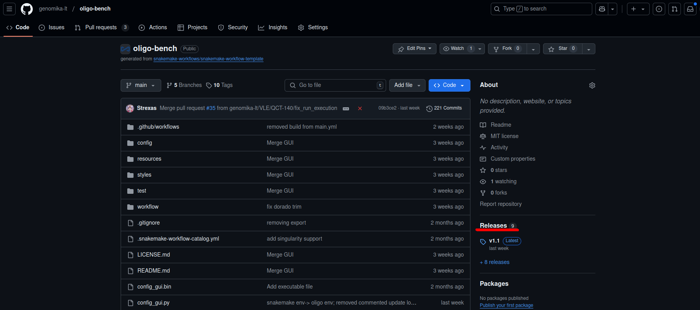
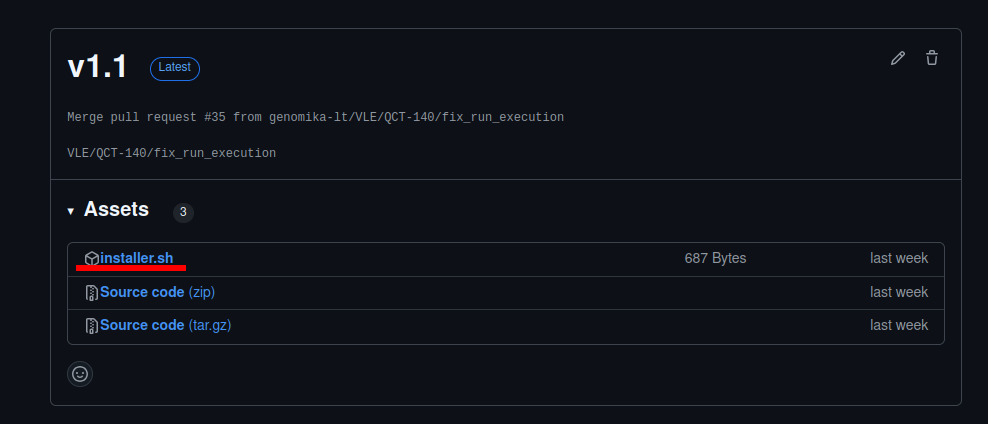
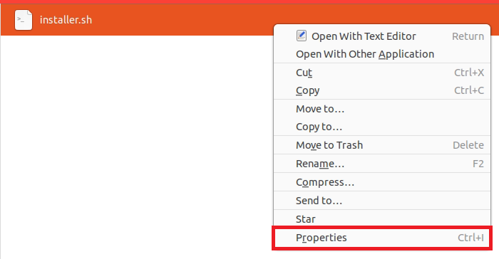
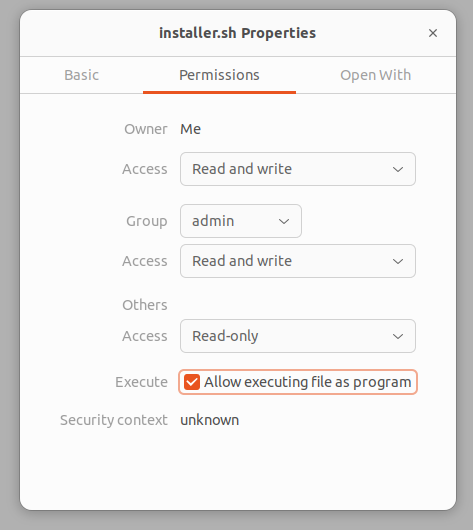
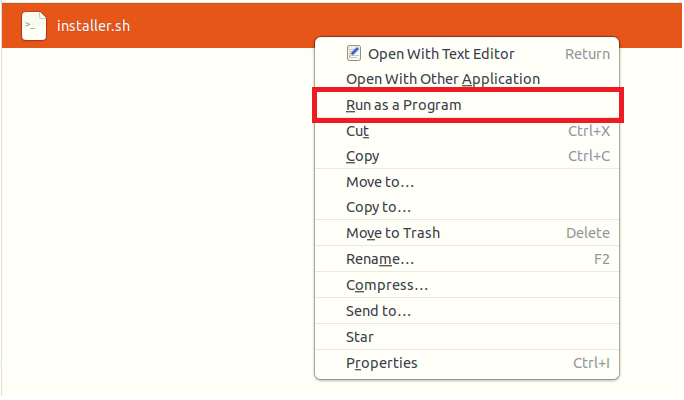
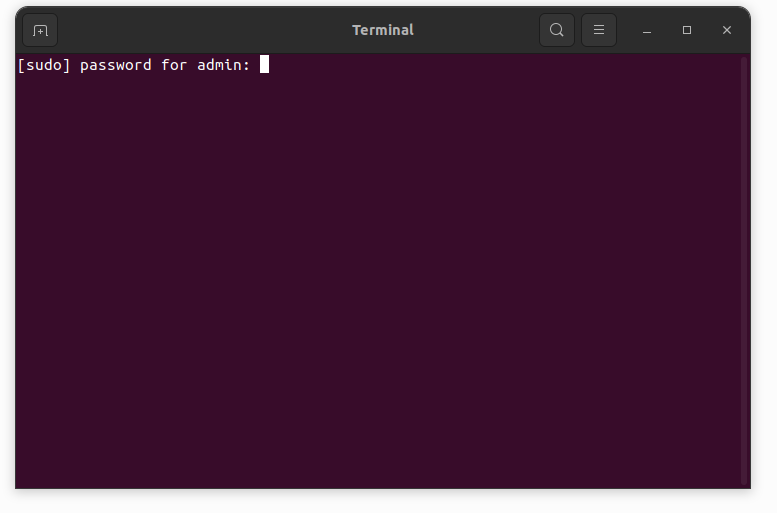

# Snakemake workflow: `GENQC`

[](https://snakemake.github.io)
[](https://github.com/jsimonas/oligo-bench/actions?query=branch%3Amain+workflow%3ATests)
[](https://pypi.org/project/PyQt6/)

A Snakemake-based tool for quality control of synthetic oligonucleotide sequencing data produced by ONT sequencers, developed for Ubuntu.

## Installation
### For not bioinformaticians
1. On the right side you should find Release window and open it by clicking "Releases"</br>


2. Once you open window, at the very top you will see latest release version. Press on `installer.sh` to download it. *Download it into folder where you want to install our tool.* If you download script and install into "Downloads" folder, after cleaning "Downloads" you may cry a lot.</br>


3. With right click open properties of downloaded file.</br>


4. Go to "Permissions" and make sure "Allow executing file as program" is pressed. You can close a window.</br>


5. With right of  click on the same file press "Run as program"</br>


6. Enter password from current user and Press Enter. <b>You will NOT see the entered symbols</b></br>


7. If installation is successful, you will see `oligo-bench` folder with all required content inside. Otherwise create Issue in tab "Issues" on GitHub.

## For bioinformaticians
1. Install miniconda, if you do not have it.
2. Download and unzip project.
3. Go inside project
```bash
cd oligo-bench-main
```
4. Create conda environment
```bash
conda create -c conda-forge -c bioconda -p ./oligo snakemake minimap2 last samtools pandas snakefmt pysam plotly PyYAML requests -y
```
5. If you prefer to have possibility to run UI, install PyQt6
```bash
conda activate -p ./oligo
pip install PyQt6
```

## Running
### For not bioinformaticians
1. Open "oligo-bench" folder to see all the files.
2. With right click on `UI.sh` press "Run as program"

### For bioinformaticians
1. Activate environment
```bash
conda activate -p ./oligo
```
2. Run script
```bash
./run.sh
```
